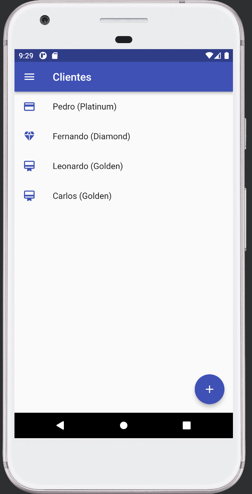

# Flutter: Complex state management

This Flutter course will teach you how to:

- > What is state and state managers

- > How to install and use Provider as a state manager

- > Formulate states following the concept of single source of truth

- > How to organize models that use the concepts of `change notifier`

- > Create state-focused widgets and data passing

## 🔨 Project: Client Control

The course project consists of customer management so that we can register customers, types of customers and link the types registered with customers using state management approaches.

## ✔️ Techniques and technologies

**Take a closer look at what you will learn about:** 

- `Provider`: You will learn what the provider is and its power as a state manager.
- `Consumer`: Read data from the only source of truth through the Consumer Widget.
- `Provider.of`: Understand how to access state values outside the Widgets tree.
- `ChangeNotifier`: It makes it possible to prepare a model to work as the only source of truth.
- `notifyListeners()`: Notifies the bugging of changes in the state and notifies the component of 
  the new state.
- `MultiProvider`: It is responsible for providing a means of managing multiple providers in the 
  project's Widgets tree.
- `Redux`: Understand the concepts and principles of managers based on Redux.
- `BloC`: See how the theory of managers who implement the BloC standard works.
 

## 🛠️ Abrir e rodar o projeto

**Para executar este projeto você precisa:**

- Having an IDE, which can be the  [Android Studio](https://developer.android.com/) installed on 
  your machine
- Have the [SDK do Flutter](https://docs.flutter.dev/get-started/install) version 3.0.0

## 📚 More course information

Certificate: 'https://cursos.alura.com.br/certificate/eaec9ad4-a526-4df7-9ef3-8fc27eebcfd8'

